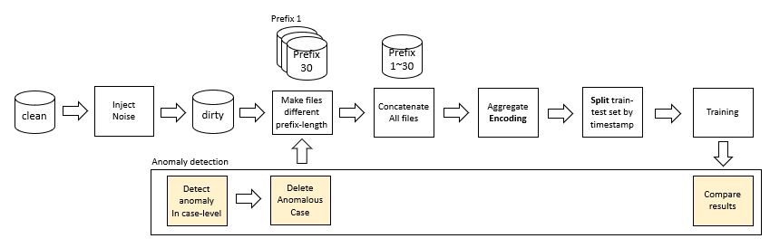

# Optimized Data Preparation Pipelines for Predictive Process Monitoring

**Writer:** Yeonsu Kim  
**Date:** 2024-06-24

# Introduction
The code for 'Optimized Data Preparation Pipelines for Predictive Process Monitoring'

In modern business environments, process monitoring is vital for improving organizational efficiency and performance. The effectiveness of predictive models in this context heavily depends on the quality and preparation of the data. This research focuses on optimizing data preprocessing pipelines using machine learning techniques to enhance the accuracy and reliability of predictive models in process monitoring. By implementing advanced ML-based data preparation methods, we aim to significantly boost the performance of predictive process monitoring systems.

# Folder

```bash
└─Github
   │  README.md
   │  image.png
   ├─codes
   │      01-abnormal_patterns.py
   │      01-abnormal_patterns_sys.py
   │      01-PBARdata bpic12.ipynb
   │      01-PBARdata bpic15.ipynb
   │      02-temp.ipynb
   │      03-concat.ipynb
   │      04-PPM (noise).ipynb
   │      05-preprocessing.R
   │      06-PCA.R
   │      07-adjusted_leverage.R
   │      08-filter.ipynb
   │      09-temp.ipynb
   │      10-concat.ipynb
   │      11-PPM (washed).ipynb
   └─folders
      ├─input
      ├─output
      ├─temp
      ├─concat
      ├─result_noise
      ├─preprocessed
      ├─pca
      ├─leverage
      ├─filtered
      ├─washed_temp
      ├─washed_concat
      └─result_washed
```

# Code
Preprocessing, Anomaly patterns, PBARdata baseline code from github @jonghyeonk



1. Create the input and output folders. The input folder will contain the cleaned event logs, and the output folder will store the files with inserted noise. The types of noise injected in this experiment include insert, moved, replace, rework, and skip [1].

2. Save the files created with prefix lengths from 1 to 30 in the temp folder.

3. Combine the files with prefix lengths from 1 to 30 in the concat folder.

4. Perform aggregate encoding and split the train and test sets based on timestamps. After performing Predictive Process Monitoring (PPM), save the results in the result_noise folder. This completes the PPM results for the noise files.

5. Next, create the washed files. Use the preprocessing.R script to preprocess the output files from step 1, which contain noise.

6. Reduce the dimensions to 2 using the PCA.R script.

7. Calculate the leverage for the dimension-reduced files using the adjusted_leverage.R script [2]. These files are stored in the leverage folder.

8. Use the filter.ipynb script to filter out anomalies, creating files with anomaly ratios of 10%, 20%, 30%, and 40%. The filtered files, containing only normal data, are stored in the filtered folder. The folders are named target_ratio_10, target_ratio_20, target_ratio_30, and target_ratio_40 according to the percentage.

9. Generate temp files from 1 to 30 for each washed file.

10. Combine the generated temp files.

11. Perform PPM and save the results in the result_washed folder.

# tips

If you encounter permission errors, use the following code:

```python
import os
os.chmod('//', 0o700)
```

# Reference
**[1]** Ko, J., Lee, J., & Comuzzi, M. (2020). AIR-BAGEL: An Interactive Root cause-Based Anomaly Generator for Event Logs. Department of Industrial Engineering, Ulsan National Institute of Science and Technology (UNIST), Ulsan, Republic of Korea.
**[2]** Ko, J., & Comuzzi, M. (2021). Online anomaly detection using statistical leverage for streaming business process events. Information Sciences, 560, 30-47. https://doi.org/10.1016/j.ins.2020.12.079

